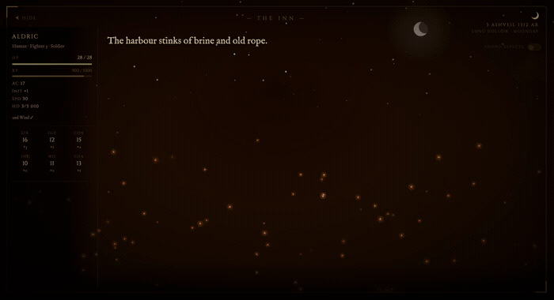
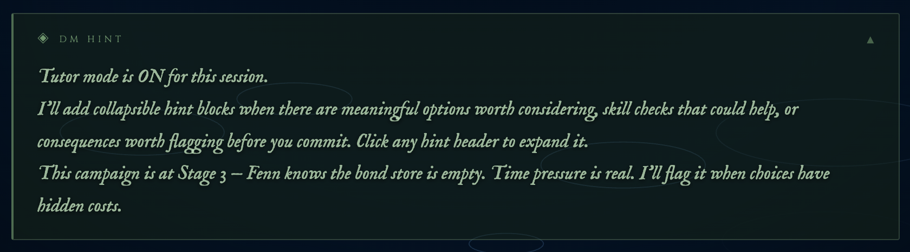
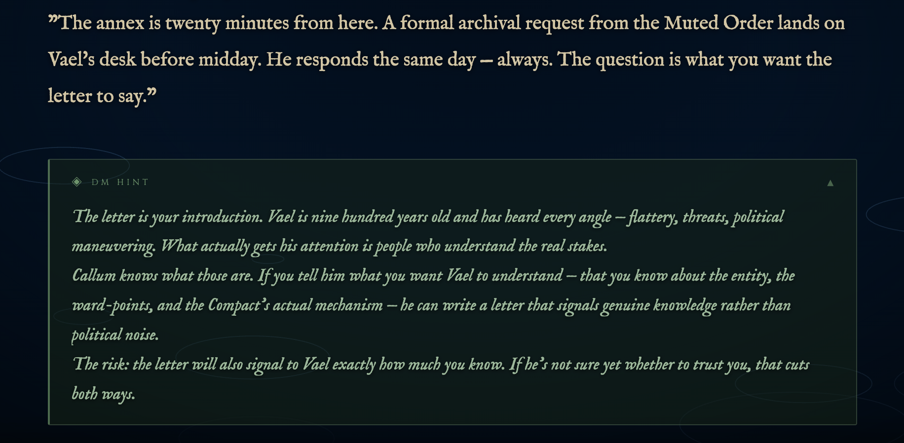
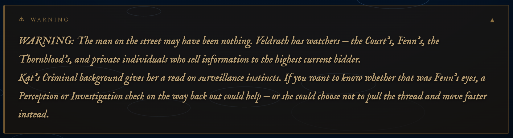

# Unofficial D&D Claude Dungeon Master
### *with Cinematic Display Companion — Couch Co-op Edition*

> Claude runs the game. You play. The TV shows the story.

An unofficial D&D 5e Dungeon Master skill for [Claude Code](https://claude.ai/code) — persistent campaigns, full 5e mechanics, and an optional cinematic display companion that streams typewriter narration, dice rolls, and live character stats to any screen while you play.

Built for groups who want a real DM experience without needing one at the table.



---

## What This Is

You run `/dnd load my-campaign` in Claude Code. Claude becomes your DM — rolling dice, voicing NPCs, tracking HP and XP, and running combat. If you have a TV or tablet nearby, the **cinematic display companion** puts the narration on screen in real time — typewriter effect, atmospheric backgrounds that shift with the scene, a dynamic sky canvas, and a live party stat sidebar. Open it on any device on your network and everyone at the table can follow along.

It is not an official Wizards of the Coast product. It uses Claude as the DM engine. It takes the rules seriously and the storytelling even more seriously.

---

## Features

- **Persistent campaigns** — state, NPCs, quests, and characters survive across sessions in plain markdown files
- **Full D&D 5e mechanics** — initiative, attacks, saving throws, spell slots, XP, levelling up, short/long rests
- **Atmospheric DM** — dark fantasy tone, distinct NPC voices, hidden rolls, a world that reacts to choices
- **Cinematic display companion** — typewriter narration, scene-reactive backgrounds, live party sidebar; cast, mirror, or open on any screen on your network
- **Dynamic sky canvas** — clouds, sun, moon, and stars rendered in real time from world_time data; transitions with time of day and weather
- **Browser-side sound effects** — 12 SFX types synthesized on demand (numpy) and played via Web Audio API; works on any device with the browser tab open, including phones on LAN
- **LAN mode** — serve the display to any device on your local network; token-authenticated write endpoints
- **17 scene types** — auto-detected from narration keywords — tavern, dungeon, ocean, crypt, arcane, glacier, and more
- **Clickable character sheets** — tap any sidebar card to open a full character sheet modal (attacks, features, inventory); works on phones and tablets via LAN
- **Tutor / learning mode** — collapsible hint blocks and consequence warnings on the display; collapsed by default, opt-in per session
- **Couch co-op** — multiple characters, shared display, turn order visible to everyone in the room
- **Combat tracker** — auto-rolled initiative, `▶` turn pointer, HP bars, inline dice math sent to display
- **8 helper scripts** — dice, ability scores, combat, character stats, conditions/tracker, calendar, SRD data pull, SRD lookup

---

## How It Works

```
Claude Code CLI  ──→  /dnd commands  ──→  campaign files (~/.claude/dnd/)
                                              state.md · world.md · npcs.md
                                              session-log.md · characters/

Optional display pipeline:
  send.py / push_stats.py  ──→  Flask SSE server (localhost:5001)
                                      ↓
                              Browser tab (any device on your network)
                                 TV via Cast or screen mirror
                                 iPad / tablet — open in Safari or Chrome
                                 Second monitor — open a local browser window
```

The Flask server receives narration text, player actions, dice results, and character stats via HTTP POST. It broadcasts everything in real time to connected browsers via Server-Sent Events. The browser renders narration as a typewriter effect over a scene-reactive gradient background, with a dynamic sky layer and a live character sidebar.

---

## Prerequisites

- [Claude Code](https://claude.ai/code) CLI installed
- Python 3.10+
- `pip3 install flask flask-cors numpy` (display companion only)

---

## Installation

```bash
# 1. Clone into your Claude skills directory
git clone https://github.com/Bobby-Gray/claude-dnd-skill ~/.claude/skills/dnd

# 2. Install display companion dependencies (optional)
pip3 install flask flask-cors numpy

# 3. That's it — no other setup required
```

> **Claude Code skills** live in `~/.claude/skills/`. Once cloned, the `/dnd` command is available in any Claude Code session.

---

## Quick Start

```
/dnd new my-campaign         # create a new campaign
/dnd character new           # create a character
/dnd load my-campaign        # start a session (asks about display companion)
```

Once loaded, type naturally — no `/dnd` prefix needed. The DM interprets everything as in-game action.

---

## Campaign Commands

| Command | Description |
|---------|-------------|
| `/dnd new <name>` | Create a new campaign — generates world seed, NPCs, starting location |
| `/dnd load <name>` | Load an existing campaign and enter DM mode |
| `/dnd save` | Write session events to log, update state and character files |
| `/dnd end` | Save session, append recap, stop display companion |
| `/dnd list` | List all campaigns with last session date and count |
| `/dnd recap` | In-character 3–5 sentence recap of the last session |
| `/dnd world` | Display world lore |
| `/dnd quests` | Show active quests and open threads |
| `/dnd tutor on` | Enable tutor/learning mode for this session |
| `/dnd tutor off` | Disable tutor/learning mode |

---

## Character Commands

| Command | Description |
|---------|-------------|
| `/dnd character new` | Create a character — guided point buy or rolled stats |
| `/dnd character sheet [name]` | Display a character sheet |
| `/dnd level up [name]` | Level up a character — applies class features, HP roll |

### Character Creation

The creation flow walks through:
1. Name, race, class, background
2. **Point buy** (validates against 27-point budget) or **rolled** (3 arrays of 4d6kh3 to choose from)
3. Racial bonuses applied automatically
4. Derived stats calculated via `character.py`
5. Starting equipment assigned by class + background
6. Sheet written to `characters/<name>.md`

---

## Combat System

```
/dnd combat start
```

1. Identifies all combatants, collects DEX mods, HP, AC
2. Auto-rolls initiative for **every combatant** including PCs — results sent to display
3. Tracks HP, conditions, turn order across rounds
4. Resolves NPC/monster attacks inline with full dice math:
   ```
   Goblin attacks: d20(14) + 4 = 18 vs AC 16 — hit! 1d6(3) + 2 = 5 piercing
   ```
5. Players roll their own attack/skill/save numbers — DM resolves everything else

### Combat Display

During combat the sidebar shows a live turn order with a `▶` pointer:

```
— COMBAT — Round 2
▶ Aldric
  Skeleton
  Mira
```

The pointer advances after each turn. HP bars update in real time when damage is taken. Combat ends with `--turn-clear`.

---

## NPC System

```
/dnd npc Osk             # portray an existing NPC or generate a new one
/dnd npc attitude Osk friendly   # shift attitude on the 5-step scale
```

Every NPC gets: role, stat block, demeanor, motivation, secret, and a speech quirk. Attitudes shift on a 5-step scale: `hostile → unfriendly → neutral → friendly → allied`. Changes are logged with reason and date in `npcs.md`.

---

## Resting

```
/dnd rest short    # 1 hour — spend Hit Dice, recharge some features
/dnd rest long     # 8 hours — full HP, half Hit Dice back, all spell slots
```

Long rests advance the in-world clock in `state.md`.

---

## Tutor / Learning Mode

New players can enable an optional guided layer that runs alongside the normal DM narration:

```
/dnd tutor on    # enable for this session
/dnd tutor off   # disable
```

When active, the display companion shows collapsible hint blocks after each scene, decision point, and significant roll:

- **DM Hint** (green border) — skills worth attempting, visible options, what each path might cost
- **Warning** (amber border) — flags irreversible choices before the player commits
- **After failed rolls** — brief mechanical explanation of what happened and why
- **Combat** — reminder of unused bonus actions, reactions, or features available that turn



Hints can surface contextual NPC and situation knowledge the DM would naturally flag for a new player:



Warnings use an amber border to distinguish irreversible or high-stakes choices before the player commits:



Hint blocks are **collapsed by default** — click or tap the header to expand. Experienced players can ignore them entirely; new players get the scaffolding without it cluttering the screen.

Tutor mode is session-scoped. It does not persist to the next `/dnd load` unless set again.

---

## Cinematic Display Companion

An optional local web server (`display/app.py`) that renders DM narration on any screen — TV, tablet, phone, or second monitor.

### Setup

```bash
pip3 install flask flask-cors numpy
```

### Starting the Display

The display starts automatically when you answer **y** at the `/dnd load` prompt. Or start it manually:

```bash
# Standard (localhost only)
python3 ~/.claude/skills/dnd/display/app.py

# LAN mode — serve to phones, tablets, other devices on your network
python3 ~/.claude/skills/dnd/display/app.py --lan
```

In LAN mode a token is generated and stored at `display/.token`. The `send.py` and `push_stats.py` scripts read this token automatically — no manual configuration needed.

### Viewing Options

Open the display URL in a browser, then choose how to show it:

| Option | How |
|--------|-----|
| **TV — Cast tab** | Chrome → three-dot menu → Cast → Cast tab; select your Chromecast or smart TV |
| **TV — Screen mirror** | macOS: Control Centre → Screen Mirroring → Apple TV / AirPlay receiver |
| **iPad / tablet** | Start with `--lan`, open `http://<your-ip>:5001` in Safari or Chrome; works in landscape |
| **Second monitor** | Open `http://localhost:5001` in a browser window and drag it to the second display |

```bash
# Same machine
open http://localhost:5001

# LAN device (iPad, phone, another computer)
open http://<your-machine-ip>:5001
```

### Two Operational Modes

**Option A — Wrapper (fully automatic)**

Routes all Claude CLI output through the display automatically — no manual sends needed.

```bash
python3 ~/.claude/skills/dnd/display/wrapper.py           # new session
python3 ~/.claude/skills/dnd/display/wrapper.py --resume  # resume session
```

**Option B — Direct send (works inside any existing session)**

The DM sends narration, player actions, and dice results explicitly:

```bash
# DM narration
python3 ~/.claude/skills/dnd/display/send.py << 'EOF'
The tavern reeks of old ale and burnt tallow.
EOF

# Player action (shows character name prefix on display)
python3 ~/.claude/skills/dnd/display/send.py --player Aldric << 'EOF'
Aldric draws his greatsword and steps forward.
EOF

# Dice result (gold inline styling)
echo "Aldric — Perception: d20+1 = 17 → Sharp" | \
  python3 ~/.claude/skills/dnd/display/send.py --dice
```

### Scene Detection

The server scans narration text for keywords and crossfades the background gradient and particle type to match the current environment. Scenes change automatically as the story moves.

| Scene | Trigger Keywords | Particles |
|-------|-----------------|-----------|
| Tavern | inn, hearth, ale, tallow, barkeep | embers |
| Dungeon | corridor, torch, portcullis, dank | dust |
| Ocean / Docks | dock, harbour, wave, tide, ship | ripples |
| Forest | tree, canopy, moss, thicket, grove | leaves |
| Crypt | tomb, undead, skeleton, burial | smoke |
| Arcane | ritual, rune, sigil, incantation | sparks |
| Mountain | glacier, frost, blizzard, ridge | snow |
| Cave | stalactite, grotto, echo, drip | mist |
| Night | midnight, moon, constellation | stars |
| City / Town | market, cobble, district, crowd | rain |
| Swamp | swamp, bog, marsh, mire | mist |
| + 7 more | mine, castle, ruins, desert, fire, temple | — |

Scene transitions crossfade over ~2.5 seconds. The server maintains a 20-chunk rolling window for detection so scenes don't flicker on single keyword matches.

### Dynamic Sky Canvas

A canvas layer rendered above the scene background shows a live sky that reacts to `world_time` data pushed via `push_stats.py`:

- **Time of day** — sun arcs from dawn (lower-left) through midday (top-center) to dusk (lower-right); switches to crescent moon + twinkling stars at night; twilight shows an orange horizon
- **Weather** — calm: 2 light clouds; overcast: 5 heavy dark clouds, dimmed sun; rainy: dense cloud cover, muted palette; stormy: near-black sky; clear night: full star field
- **Clouds** — 5 cloud objects each built from 8 overlapping circles; drift slowly left and wrap

Push world_time data after loading a campaign and after any rest or time advance:

```bash
python3 ~/.claude/skills/dnd/display/push_stats.py --world-time \
  '{"date":"19 Ashveil 1312 AR","day_name":"Moonday","time":"morning","season":"Long Hollow","weather":"calm"}'
```

Valid `time` values: `dawn`, `morning`, `midday`, `afternoon`, `evening`, `dusk`, `night`
Valid `weather` values: `calm`, `clear`, `overcast`, `rainy`, `stormy`

### Sound Effects

Narration text is scanned server-side for 12 SFX trigger categories. When a match is found, the browser fetches a synthesized WAV file and plays it via Web Audio API — no server audio output, works on any device with the tab open.

```
impact · sword · arrow · shout · thud · magic · coins · door · low_hum · fire · breath
```

SFX synthesis uses numpy — if numpy is not installed, the feature degrades silently. Enable via the **Sound Effects** toggle in the top-right of the display.

**Trigger examples:**

| Narration text | SFX |
|----------------|-----|
| "...strikes the shield..." | impact |
| "...draws her blade..." | sword |
| "...looses an arrow..." | arrow |
| "...he roars across the dock..." | shout |
| "...collapses to the floor..." | thud |
| "...arcane energy crackles..." | magic |
| "...coins spill across the table..." | coins |
| "...the door creaks open..." | door |
| "...the altar hums with energy..." | low_hum |
| "...the torch flares..." | fire |
| "...a sharp exhale..." | breath |

The browser caches each WAV after first fetch. SFX trigger naturally alongside the typewriter animation since both are driven by the same narration chunks.

### Live Character Sidebar

A fixed left sidebar shows live stats for all party members, updated automatically as play progresses.

```bash
# Push full stats on campaign load (clears stale characters from previous campaigns)
python3 ~/.claude/skills/dnd/display/push_stats.py --replace-players --json '{
  "players": [{
    "name": "Aldric", "race": "Human", "class": "Fighter", "level": 2,
    "hp": {"current": 14, "max": 18}, "xp": {"current": 220, "next": 300},
    "ac": 17, "initiative": "+1", "speed": 30,
    "hit_dice": {"remaining": 2, "max": 2, "die": "d10"},
    "ability_scores": {
      "str": {"score": 16, "mod": "+3"}, "dex": {"score": 12, "mod": "+1"},
      "con": {"score": 15, "mod": "+2"}, "int": {"score": 10, "mod": "+0"},
      "wis": {"score": 11, "mod": "+0"}, "cha": {"score": 13, "mod": "+1"}
    }
  }]
}'

# Partial updates during play
python3 ~/.claude/skills/dnd/display/push_stats.py --player Aldric --hp 10 18
python3 ~/.claude/skills/dnd/display/push_stats.py --player Aldric --xp 270 300

# Combat turn order
python3 ~/.claude/skills/dnd/display/push_stats.py \
  --turn-order '{"order":["Aldric","Skeleton","Mira"],"current":"Aldric","round":1}'

# Advance turn pointer
python3 ~/.claude/skills/dnd/display/push_stats.py --turn-current "Skeleton"

# Combat ended
python3 ~/.claude/skills/dnd/display/push_stats.py --turn-clear

# World time clock
python3 ~/.claude/skills/dnd/display/push_stats.py --world-time \
  '{"date":"3 Duskfall 1312 AR","day_name":"Ironday","time":"evening","season":"Long Hollow","weather":"overcast"}'
```

The sidebar:
- Shows compact dual-column cards for parties of 2+ (full ability grid for solo play)
- HP bars shift green → yellow → red as HP drops
- XP bar fills toward next level
- Fades in automatically on first stats push
- Persists across Flask restarts (`stats.json`)
- Cleared automatically on `/dnd new` (fresh campaign)


### Clickable Character Sheet

Click or tap any character card in the sidebar to open a full character sheet modal — attacks, features, and inventory at a glance. Works on desktop and on phones/tablets connected via LAN.


Include the `sheet` field when pushing stats on `/dnd load` to populate the full sheet:

```bash
python3 ~/.claude/skills/dnd/display/push_stats.py --replace-players --json '{
  "players": [{
    "name": "Aldric",
    ...
    "sheet": {
      "attacks": [
        {"name": "Longsword", "bonus": "+5", "damage": "1d8+3", "type": "Slashing", "notes": "Versatile (1d10)"}
      ],
      "features": [
        {"name": "Second Wind", "text": "Bonus action: regain 1d10+level HP. Short/long rest recharge."}
      ],
      "inventory": ["Longsword", "Chain Mail", "Shield", "Explorer'\''s Pack", "15 gp"]
    }
  }]
}'
```

If `sheet` is omitted, the modal still opens but shows only the stats visible in the sidebar. Close with **Esc**, clicking outside the panel, or the ✕ button.

### Replay Buffer

The server buffers the last 60 text chunks to disk (`text_log.json`). Reconnecting browsers (connection drop, Cast interruption, tab refresh) replay the full session history automatically — no narration is lost.

---

## Scripts Reference

All scripts live in `~/.claude/skills/dnd/scripts/`.

### `dice.py` — All dice rolls

```bash
python3 scripts/dice.py d20+5
python3 scripts/dice.py 2d6+3
python3 scripts/dice.py d20 adv          # advantage
python3 scripts/dice.py d20+3 dis        # disadvantage + modifier
python3 scripts/dice.py 4d6kh3          # keep highest 3 (ability score roll)
python3 scripts/dice.py d20 --silent    # integer only (for hidden rolls)
```

Flags nat 20 (`CRITICAL HIT`) and nat 1 (`FUMBLE`) automatically.

### `ability-scores.py` — Character creation

```bash
python3 scripts/ability-scores.py roll                          # 3 arrays to choose from
python3 scripts/ability-scores.py pointbuy                     # print cost table
python3 scripts/ability-scores.py pointbuy --check STR=15 DEX=10 CON=15 INT=8 WIS=11 CHA=12
python3 scripts/ability-scores.py modifiers STR=15 DEX=10 CON=15 INT=8 WIS=11 CHA=12
```

### `combat.py` — Initiative and attack resolution

```bash
# Roll initiative for all combatants and print tracker
python3 scripts/combat.py init '[
  {"name":"Aldric","dex_mod":1,"hp":18,"ac":17,"type":"pc"},
  {"name":"Skeleton","dex_mod":2,"hp":13,"ac":13,"type":"npc"}
]'

# Reprint tracker from saved state
python3 scripts/combat.py tracker '<state_json>' <round_num>

# Resolve a single attack
python3 scripts/combat.py attack --atk 5 --ac 13 --dmg 1d8+3
```

`init` outputs a `STATE_JSON:` line — save this to `state.md` under `## Active Combat` for persistence between turns.

### `character.py` — Stat derivation and levelling

```bash
# Full stat block from raw scores
python3 scripts/character.py calc --class fighter --level 2 \
    STR=16 DEX=12 CON=15 INT=10 WIS=11 CHA=13 \
    --proficient STR CON Athletics Intimidation Perception Survival

# Level-up
python3 scripts/character.py levelup --class fighter --from 2 --hp-roll 8 --con-mod 2

# XP tracking
python3 scripts/character.py xp --level 2 --gained 150
```

---

## File Layout

```
~/.claude/skills/dnd/
├── SKILL.md                  # Skill definition and DM instructions
├── README.md                 # This file
├── scripts/
│   ├── dice.py
│   ├── ability-scores.py
│   ├── combat.py
│   ├── character.py
│   ├── tracker.py
│   ├── calendar.py
│   ├── data_pull.py
│   └── lookup.py
├── display/
│   ├── app.py                # Flask SSE server
│   ├── audio.py              # SFX synthesis and browser trigger (numpy)
│   ├── wrapper.py            # PTY wrapper — auto-captures Claude CLI output
│   ├── send.py               # Direct send for narration/dice/player actions
│   ├── push_stats.py         # Character stats, combat turn order, world_time
│   ├── start-display.sh      # One-command display startup
│   ├── requirements.txt      # flask, flask-cors, numpy
│   └── templates/
│       └── index.html        # Browser frontend
└── templates/
    ├── character-sheet.md
    ├── state.md
    ├── world.md
    ├── npcs.md
    └── session-log.md

~/.claude/dnd/campaigns/<name>/
├── state.md                  # Current location, party status, active quests
├── world.md                  # World lore and setting details
├── npcs.md                   # NPC index with stat blocks and attitudes
├── session-log.md            # Session history and recaps
└── characters/
    ├── Aldric.md
    └── Mira.md
```

---

## DM Philosophy

The skill is designed around a set of hard constraints, not aspirational notes:

- **Improvise over script** — the world is a sandbox; player choices always find a "yes, and..."
- **Consequences are real** — NPCs remember conversations; factions shift; failure is possible
- **Economy of description** — two sharp sensory details beat a paragraph of exposition
- **Every NPC is a person** — even minor characters get a verbal tic, a contradiction, a goal
- **Hidden rolls stay hidden** — Perception, Insight, and Stealth roll silently; only the outcome is narrated (but results always appear on the display)

---

## License

MIT
